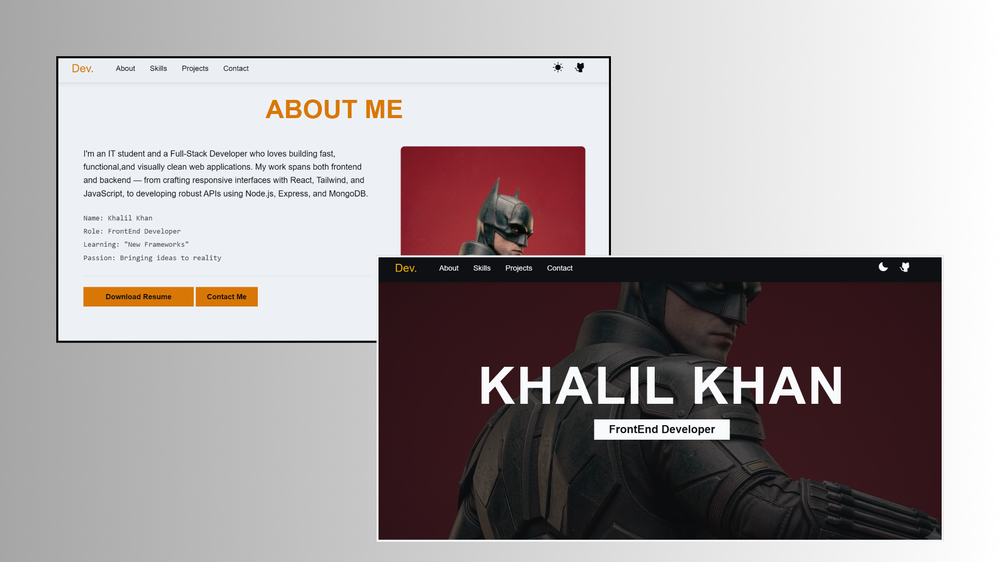

# Modern Developer Portfolio 🚀

A sleek, responsive, and high-performance portfolio website built to showcase my journey as a Full-Stack Developer. This project features a custom dark/light mode toggle, intersection observer animations, and a mobile-first design.



## ✨ Features
- **Dynamic Theming:** Seamless transition between Dark and Light modes using CSS variables and LocalStorage.
- **Smooth Animations:** Integrated Scroll-reveal animations using the `Intersection Observer API`.
- **Fully Responsive:** Optimized for all screen sizes, from mobile devices to ultra-wide monitors.
- **Modern UI:** Clean aesthetic using the Phosphor Icon library and professional typography (Anton & Roboto).

## 🛠️ Tech Stack
- **Frontend:** HTML5, CSS3, JavaScript (Vanilla)
- **Icons:** [Phosphor Icons](https://phosphoricons.com/)

## 📂 Project Structure
```text
├── assets/          # Images, Icons, and Resume PDF
├── index.html       # Main HTML structure
├── style.css        # Global styles and Theming logic
├── script.js        # Sidebar logic, Theme toggling, and Animations
└── README.md        # Project documentation